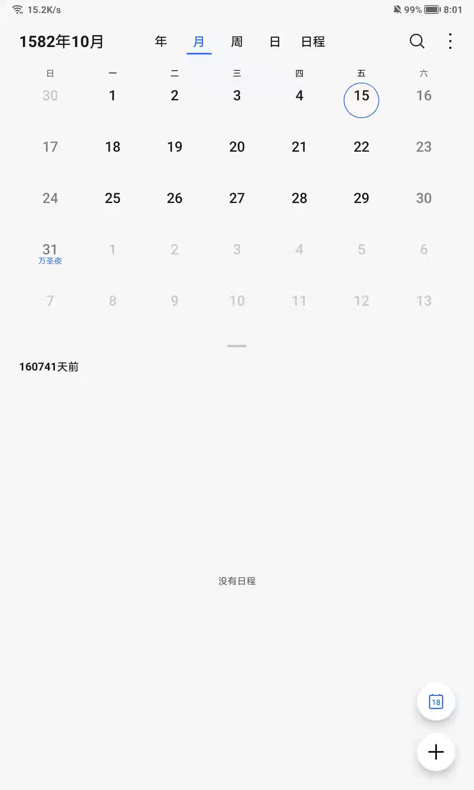

# 程序设计课题——万年历的实现与思考

## 思考

* 要将某一年的日历打印出来，首先需要知道该年第一天是周几。
* 要计算 `任意年任意月任意日` 是周几，我们不难想到可以使用迭代法从 `1年 1月 1日` 不断迭代累加至 `所求年所求月所求日` 算出两者间隔的总天数再对 7 取余。
* 那么问题来了，公元 `1年 1月 1日` 是周几？是周一吗？

> 格勒哥里十三世废除了[儒略历](https://zh.wikipedia.org/wiki/%E5%84%92%E7%95%A5%E6%9B%86 "儒略历")。并颁布了新历法，即[格里高利历](https://zh.wikipedia.org/wiki/%E9%A2%9D%E6%88%91%E7%95%A5%E5%8E%86 "格里高利历")，又译为[格里历](https://zh.wikipedia.org/wiki/%E6%A0%BC%E9%87%8C%E6%9B%86 "格里历")。教廷规定1582年10月4日星期四之后的第二天是1582年10月15日星期五，即跳过10天。由于是格勒哥里十三世颁布，新历法被称为[格里高利历](https://zh.wikipedia.org/wiki/%E9%A2%9D%E6%88%91%E7%95%A5%E5%8E%86 "格里高利历")。
> 
> ——**维基百科**

* 所以按照格里高利历施行后的历法向前推算，`1年 1月 1日` 应为周六而非周一。

## 实现

于是我们就可以愉快地用迭代法。。。等等！如果我们使用迭代法去累加天数，那显而易见的，算法的时间复杂度为 $O(n)$ 其中 $n$ 为所求的年分，这样的时间复杂度在计算较大年分（如 $10^9$ 这个数量级）时，效率会很低。那么有没有什么办法，能够在 $O(1)$ 的时间复杂度下得知 `任意年任意月任意日` 与 `1年 1月 1日` 间隔的总天数？当然是有的。

根据格里高利历的规则：

> 每一个可以被4整除的年份都是闰年，但可以被100整除的年份，必须也能被400整除才是闰年。因此，1700年、1800年、和1900年都不是闰年，而2000年是闰年。
> 
> ——[美国海军天文台](https://zh.wikipedia.org/wiki/%E7%BE%8E%E5%9B%BD%E6%B5%B7%E5%86%9B%E5%A4%A9%E6%96%87%E5%8F%B0 "美国海军天文台")

不难发现，其实每年的天数无非就是 356天 和 366天二选一的问题。所以我们可以将所有年份都暂定为 365天对于是闰年的，只需要让天数自增1即可。但这样我们必然绕不开各种 `if-else` 满天飞的代码，那么有没有什么方法将 `if-else` 简化为一行代码呢？当然也是有的：

$$
w = 365 \times y + \left\lfloor\cfrac{y}{4}\right\rfloor - \left\lfloor\cfrac{y}{100}\right\rfloor + \left\lfloor\cfrac{y}{400}\right\rfloor
$$

其中：

* $\left\lfloor\right\rfloor$ 代表向下取整。
* $y$ 代表 1年 至 $y$ 年间隔的年份（不包含 $y$ 年本身），即此处的 $y$ 应为 $Y-1$，$Y$ 代表所求年份。

用 C 表述无非就是 `int w = 365 * y + y / 4 - y / 100 + y / 400;`

但是为了计算 `任意年任意月任意日` 与 `1年 1月 1日` 间隔的总天数，我们还需要再加上该年 1月 1日 至 所求月所求日之间的天数，这里我们只需要造两个数组模拟两个 map 分别存储闰年每月的天数和平年每月的天数即可，实现代码（C++）如下。

```C++
vector<int> months{31, 28, 31, 30, 31, 30, 31, 31, 30, 31, 30, 31};
vector<int> months_leap{31, 29, 31, 30, 31, 30, 31, 31, 30, 31, 30, 31};
inline int compute_date(int y, int m, int d) {
    int yd = 365 * (y - 1) + (y - 1) / 4 - (y - 1) / 100 + (y - 1) / 400;
    int md = 0;
    // if isLeap:
    if ((y % 4 == 0 && y % 100 != 0) || y % 400 == 0 && y)
        md = accumulate(months_leap.begin(), months_leap.begin() + m - 1, 0)
    else
        md = accumulate(months.begin(), months.begin() + m - 1, 0);
    return (yd + md + d) % 7;
}
```

但是这还不够精妙，有没有不需要造数组模拟 map 也能实现上述功能的方法？这就不得不提到我们的重头戏，蔡勒公式了。

> 蔡勒公式（德语：Zellers Kongruenz），是一种计算任何一日属一星期中哪一日的演算法，由德国数学家克里斯提安·蔡勒推算出来。

$$
w = (y + \left\lfloor\cfrac{y}{4}\right\rfloor+\left\lfloor\cfrac{c}{4}\right\rfloor-2c+\left\lfloor\cfrac{26(m+1)}{10}\right\rfloor+d-1)\text{ mod }7
$$

公式中的符号含义如下：

* w：星期（计算所得的数值对应的星期：0-星期日；1-星期一；2-星期二；3-星期三；4-星期四；5-星期五；6-星期六）
* c：年份前两位数
* y：年份后两位数
* m：月（m的取值范围为3至14，即在蔡勒公式中，某年的1、2月要看作上一年的13、14月来计算，比如2003年1月1日要看作2002年的13月1日来计算）
* d：日
* $\left\lfloor\right\rfloor$：向下取整。

但由于 C 系语言获取整数前几位数或后几位数较为繁琐，所以将公式变化后如下：

$$
w = (365\times y+\left\lfloor\cfrac{y}{4}\right\rfloor-\left\lfloor\cfrac{y}{100}\right\rfloor+\left\lfloor\cfrac{y}{400}\right\rfloor+\left\lfloor\cfrac{153\times m-457}{5}\right\rfloor+d-306)\text{ mod }7
$$

公式中的符号含义和原公式相似，但相较于朴素法公式有需要注意的地方：

* 公式前半部分 $w_1$ 中的 $y$ 与朴素算法公式中的 $y$ 代表的含义是不一样的，朴素算法中 $y$ 实际上是不包含所求年的，而蔡勒公式前半部分 $w_1$ 中的 $y$ 是包含所求年的。

$$
w_1 = 365\times y+\left\lfloor\cfrac{y}{4}\right\rfloor-\left\lfloor\cfrac{y}{100}\right\rfloor+\left\lfloor\cfrac{y}{400}\right\rfloor
$$

* 蔡勒公式的后半段 $w_2$ 中计算日期的方法实际上是巧妙地绕开了 2月的，因为平年和闰年唯一的区别就是平年 2月只有 28天，而闰年 二月有 29天，如果只计算3 月到 12月，那么无论如何天数都恒为 306天。因此，蔡勒公式的后半段中的常量 306代表的是 $y$ 年 3月 1日到 $y$ 年 12月 31日之间经过的时间：

$$
w_2=M_3+M_4+\cdots+M_12=31+30+\cdots+31=306
$$

$M_n$ 代表第 $n$ 月的天数。

但如果我们需要知道的是 1月或 2月的某一天是周几该怎么办？蔡勒公式的解决方案是不计算至 $y$ 年 12月 31日，而是计算少一年，即计算 `1.01.01 —— (y-1).12.31` 的天数后，再加上 12个月的总天数，这样一来，1月就变为了 13月，2月就变成了 14月，接着为了更加直观地理解公式是如何推出来的，我们列如下表格。该表格列出了 3月 1日到各个月份的首日之间间隔的天数。

| 月分 | 该月天数 | 该月首日与 03.01 间隔的天数 |
| --- | --- | --- |
| 03 | 31 | 0 |
| 04 | 30 | 31 |
| 05 | 31 | 61 |
| 06 | 30 | 92 |
| 07 | 31 | 122 |
| 08 | 31 | 153 |
| 09 | 30 | 184 |
| 10 | 31 | 214 |
| 11 | 30 | 245 |
| 12 | 31 | 275 |
| 13 | 31 | 306 |
| 14 | XX | 337 |

列出表格后，我们不难发现，忽略掉个位数的变化，每月首日与 03.01 间隔的差值是一个公差为 30的等差数列，而个位数的变化为 `1, 1, 2, 2, 3, 4, 4, 5, 5, 6, 7.` 我们可以用如下公式去拟合个位数的变化：

$$
\left\lfloor\cfrac{m\times 3-7}{5}\right\rfloor
$$

至于为什么该公式恰好可以拟合个位数变化，是如何推导出来的，碍于篇幅和本人极差的数学功底，在此就不做展开了，但从中不难看出蔡勒公式之巧妙。

接下来只需要将公差和个位数变化代入等差数列通项公式，即可得到蔡勒公式变化式中间部分的公式 $w_3$ 了：

$$
\begin{aligned}
    w_3&=30\times(m-3)+\left\lfloor\cfrac{m\times3-7}{5}\right\rfloor\\
       &=\left\lfloor\cfrac{153×m-457}{5}\right\rfloor
\end{aligned}
$$

然后只需要在公式的最后加上日期 $d$ 再对 7取余，就得到了最终的蔡勒公式：

$$
\begin{aligned}
    w&=w_1+w_3+d-w_2\\
     &=(365\times y+\left\lfloor\cfrac{y}{4}\right\rfloor-\left\lfloor\cfrac{y}{100}\right\rfloor+\left\lfloor\cfrac{y}{400}\right\rfloor+\left\lfloor\cfrac{153\times m-457}{5}\right\rfloor+d-306)\text{ mod }7
\end{aligned}
$$

至此，我们便不需要 24个参数也可以得知 `任意年任意月任意日` 是周几了，实现代码（C++）如下：

```C++
inline int compute_date(int y, int m, int d) {
    if (m < 3) --y, m += 12;
    return (365 * y + y / 4 - y / 100 + y / 400 + (153 * m - 457) / 5 + d - 306) % 7;
}
```

## 提高要求

蔡勒公式很好，但有一个问题，不论是蔡勒公式原式还是上文提到的变换后蔡勒公式，都是不适用于计算格里高利历采用之前（`1582.10.15` 前）的日期计算的，其实很好解决，只需要对于 `1582.10.15` 前的日期用朴素做法计算，`1582.10.15` 之后的日期采用蔡勒公式即可（因为时间复杂度都是 $O(1)$ ）。

但是需要注意的一点是，格里高利历采用前，是**不存在**“能被100整除且不能被400整除的年份是闰年”这种规定的。

实现代码如下：

```C++
#include <bits/stdc++.h>
using namespace std;

// 造俩数组当 map 使
vector<int> months{31, 28, 31, 30, 31, 30, 31, 31, 30, 31, 30, 31};
vector<int> months_leap{31, 29, 31, 30, 31, 30, 31, 31, 30, 31, 30, 31};

// 24个参数实现 O(1) 复杂度用于计算 1582年 10月 15日前的年份
inline int compute_old_date(int y, int m, int d) {
    // 这里需要注意一点，由于 1582 年格里高利历实行前是不存在“能被100整除且不能被400整除的年份是闰年”这种规定的
    int yd = 365 * (y - 1) + (y - 1) / 4 + 5;

    // 这里需要注意一点，由于 1582 年格里高利历实行前是不存在“能被100整除且不能被400整除的年份是闰年”这种规定的
    // if isLeap:
    if (y % 4 == 0)
        return (yd + accumulate(months_leap.begin(), months_leap.begin() + m - 1, 0) + d) % 7;

    return (yd + accumulate(months.begin(), months.begin() + m - 1, 0) + d) % 7;
}

// 蔡勒公式改编实现 O(1) 时间复杂度
inline int compute_date(int y, int m, int d) {
    if (m < 3) --y, m += 12;
    return (365 * y + y / 4 - y / 100 + y / 400 + (153 * m - 457) / 5 + d - 306) % 7;
}

// calendar 数组生成函数
vector<vector<int>> generate_calendar(int y) {
    int n = 365;
    // 做浅拷贝足矣，但反正也只用一行，深拷贝就深拷贝吧
    vector<int> date = months;
    // if isLeap:
    // 这里需要注意一点，由于 1582 年格里高利历实行前是不存在“能被100整除且不能被400整除的年份是闰年”这种规定的
    if (((y % 4 == 0 && y % 100 != 0) || y % 400 == 0) || (y < 1582 && y % 4 == 0))
        ++n, date = months_leap;

    // 初始化 calendar 数组
    vector<vector<int>> calendar(n, vector<int>(3));
    // 生成 calendar 数组
    int m = 1, d = 1;
    for (int i = 0; i < n; ++i) {
        // 1582年前用 compute_old_date
        if (y < 1582)
            calendar[i][0] = m, calendar[i][1] = d, calendar[i][2] = compute_old_date(y, m, d);
        // 1582年后用蔡勒公式
        if (y > 1582)
            calendar[i][0] = m, calendar[i][1] = d, calendar[i][2] = compute_date(y, m, d);
        // 1582年比较特殊，写个特判
        if (y == 1582) {
            if (m < 10) calendar[i][0] = m, calendar[i][1] = d, calendar[i][2] = compute_old_date(y, m, d);
            if (m == 10) {
                if (d < 15) calendar[i][0] = m, calendar[i][1] = d, calendar[i][2] = compute_old_date(y, m, d);
                else calendar[i][0] = m, calendar[i][1] = d, calendar[i][2] = compute_date(y, m, d);
            }
            if (m > 10) calendar[i][0] = m, calendar[i][1] = d, calendar[i][2] = compute_date(y, m, d);
        }
        if (++d > date[m - 1]) ++m, d = 1;
    }
    return calendar;
}

// 打印日历函数
void print_calendar(vector<vector<int>> calendar, int y) {
    int n = 365;
    if ((y % 4 == 0 && y % 100 != 0) || y % 400 == 0) ++n;

    int d = 0, m = 0;
    for (int i = 0; i < calendar.size(); ++i) {
        // 打印月及日历抬头指示
        if (m != calendar[i][0]) {
            d = 0, ++m;
            cout << "\n\n\n" << setw(11) << calendar[i][0] << "月" << endl
                             << setw(3) << "Su"
                             << setw(3) << "Mo"
                             << setw(3) << "Tu"
                             << setw(3) << "We"
                             << setw(3) << "Th"
                             << setw(3) << "Fr"
                             << setw(3) << "Sa" << endl;
        }
        // 补齐空格
        while (d != calendar[i][2]) {
            cout << "   ";
            ++d;
        }
        // 打印日
        if (y == 1582 && m == 10 && calendar[i][1] == 5) i += 10;
        cout << setw(3) << calendar[i][1];
        ++d;
        // 每七天换行
        if (d > 6) {
            cout << "\n";
            d = 0;
        }
    }
}

int main() {
    // 取消同步以提高读速
    ios_base::sync_with_stdio(false);
    while (true) {
        int year = 1;
        cout << "\n请输入年份（Ctrl-C 退出）：";
        cin >> year;
        if (year < 1) {
            cerr << "输入非法！\n";
            continue;
        }
        print_calendar(generate_calendar(year), year);
    }
    return 0;
}
```

## 有待改善

然而实际上，蔡勒公式是有可以计算儒略历日期的推导式的，不过碍于篇幅和笔者过载的大脑，此处就暂且按下不表。不过高情商地说，这也算是抛砖引玉，诸位读者如果感兴趣可以自行网络冲浪找寻答案来狠狠地薄纱本蒟蒻丑陋不堪的代码。

## 题外话

你知道吗，目前似乎只有华为 EMUI 的自带日历是准确删去了 `1582.10.05——1582.10.14` 这段时间并且 `1.01.01` 准确显示为周六的。




