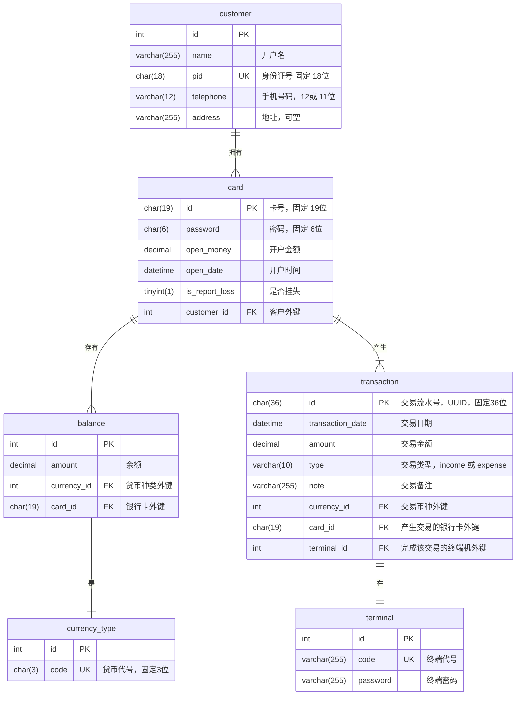

# 基于 MySQL 和 Rust 的银行 ATM 存取款机系统

## 架构

### ER 图

```mermaid
erDiagram
    customer {
        int id PK
        varchar(255) name "开户名"
        char(18) pid UK "身份证号 固定 18位"
        varchar(12) telephone "手机号码，12或 11位"
        varchar(255) address "地址，可空"
    }

    card {
        char(19) id PK "卡号，固定 19位"
        char(6) password "密码，固定 6位"
        decimal open_money "开户金额"
        datetime open_date "开户时间"
        tinyint(1) is_report_loss "是否挂失"
        int customer_id FK "客户外键"
    }

    balance {
        int id PK
        decimal amount "余额"
        int currency_id FK "货币种类外键"
        char(19) card_id FK "银行卡外键"
    }

    currency_type {
        int id PK
        char(3) code UK "货币代号，固定3位"
    }

    terminal {
        int id PK
        varchar(255) code UK "终端代号"
        varchar(255) password "终端密码"
    }

    transaction {
        char(36) id PK "交易流水号，UUID，固定36位"
        datetime transaction_date "交易日期"
        decimal amount "交易金额"
        varchar(10) type "交易类型，income 或 expense"
        varchar(255) note "交易备注"
        int currency_id FK "交易币种外键"
        char(19) card_id FK "产生交易的银行卡外键"
        int terminal_id FK "完成该交易的终端机外键"
    }

    customer ||--|{ card: "拥有"
    card ||--|{ balance: "存有"
    card ||--|{ transaction: "产生"
    balance ||--|| currency_type: "是"
    transaction ||--|| terminal: "在"
```
